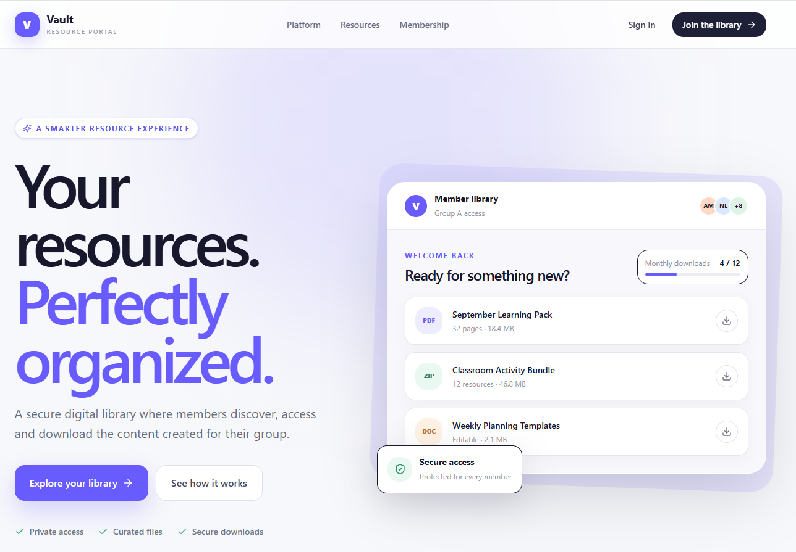
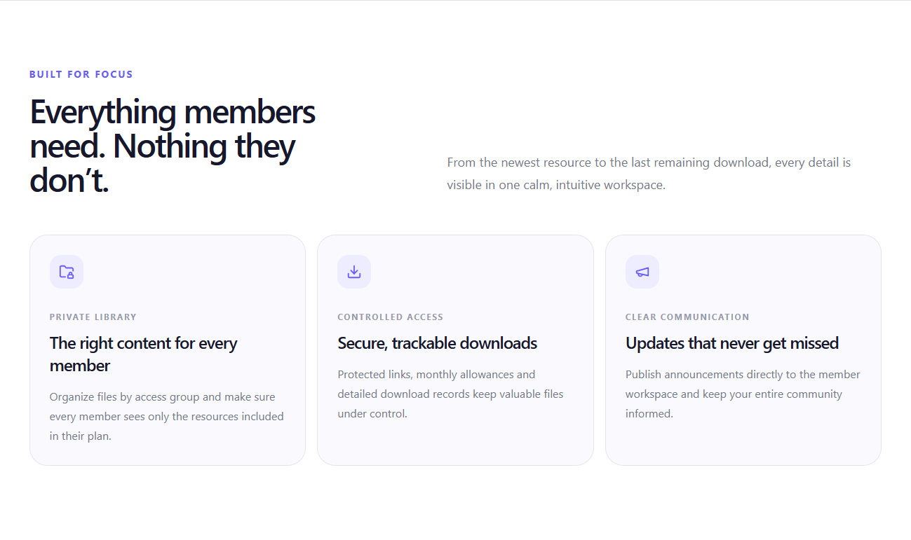
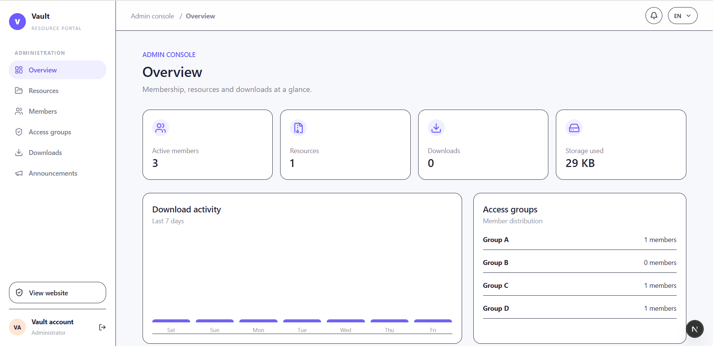
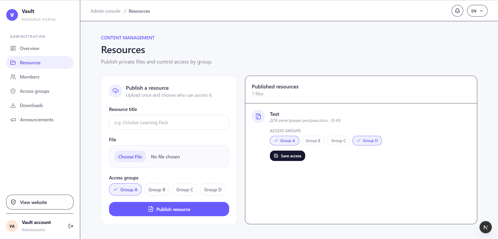

<p align="center">
  
</p>
# Bravix Resource Vault

A secure resource portal for organizations, communities and membership-based platforms — built by **Bravix Creative**.

Bravix Resource Vault provides private file distribution, member access groups, controlled downloads, announcements and a dedicated administration console through one scalable web application.

> This repository is a public showcase of the product architecture, features and selected implementation patterns. The production source code remains private.

---

## Highlights

- Private member resource library
- Secure file distribution
- Group-based access control
- Member management
- Download limits and tracking
- Resource publishing
- Announcements
- Administration console
- Download activity monitoring
- Storage usage overview
- Multi-language foundation
- Responsive member experience

---

## Tech Stack

`Next.js` `React` `TypeScript` `Tailwind CSS`

`Supabase` `PostgreSQL` `Authentication` `Storage`

`Vercel` `SEO` `Responsive UI`

---

## Product Architecture

The application is separated into three primary layers:

### Public Experience

Focused on resource discovery, navigation and content consumption.

### Application Layer

Handles routing, filtering, server-side data access and reusable interface components.

### Admin Experience

Provides authenticated management workflows for maintaining resources and structured content.

For a more detailed overview:

[View Architecture →](./docs/architecture.md)

---

## Core Features

### Resource Discovery

Users can browse and discover curated resources through structured categories and an optimized browsing experience.

### Search & Filtering

Resources can be quickly narrowed down using search and filtering patterns designed for larger datasets.

### Resource Detail Pages

Individual resources have structured detail views containing the information required for evaluation and discovery.

### Admin Dashboard

Authenticated administrators can manage platform content without modifying application code.

### Structured Content

Resources are modeled consistently to support maintainability and future expansion.

[Explore Features →](./docs/features.md)

---

## Selected Implementation Patterns

This showcase includes simplified examples demonstrating parts of the architecture without exposing production code or credentials.

### Supabase Data Access

```ts
const { data, error } = await supabase
  .from("resources")
  .select("id, title, slug, category")
  .eq("published", true)
  .order("created_at", { ascending: false });
```

### Metadata

```ts
export function createResourceMetadata(resource: Resource) {
  return {
    title: resource.title,
    description: resource.description,
    alternates: {
      canonical: `/resources/${resource.slug}`,
    },
  };
}
```

---

## Product Preview

### Member Experience

A private resource portal designed around simple discovery, controlled access and secure downloads.

<p align="center">
  
</p>

### Built Around the Member

Resources are organized around access groups, controlled downloads and direct communication — keeping the member experience simple while maintaining control behind the scenes.

<p align="center">
  
</p>

### Admin Console

The administration layer provides a central overview of members, resources, downloads, storage and access groups.

<p align="center">
  
</p>

### Resource & Access Management

Administrators can publish private files and control exactly which member groups can access each resource.

<p align="center">
  
</p>

---

## Security & Source Code

The production repository is private.

This showcase intentionally excludes:

- Environment variables
- API keys
- Authentication secrets
- Production database configuration
- Internal administration logic
- Private infrastructure details

The examples included here are simplified implementation patterns intended for portfolio and technical demonstration purposes.

---

## About Bravix Creative

We design and develop modern digital products for brands and growing businesses.

**Web Development · E-commerce · UI/UX · SEO & Performance**

[Visit Bravix Creative →](https://bravixcreative.com)

---

Built by **Bravix Creative**.
